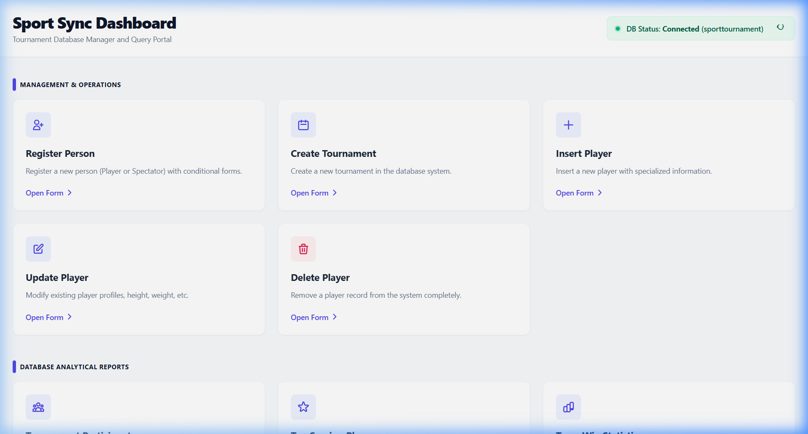
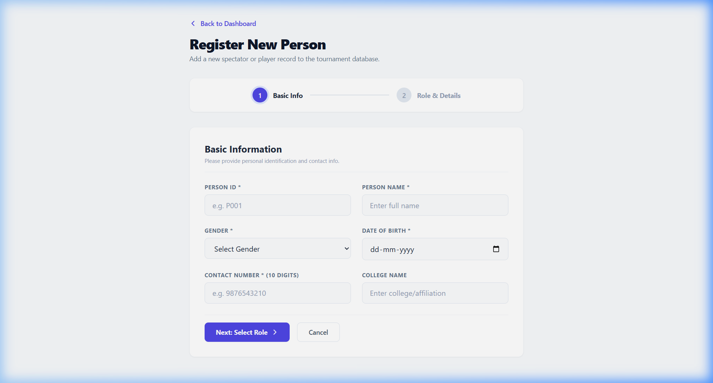
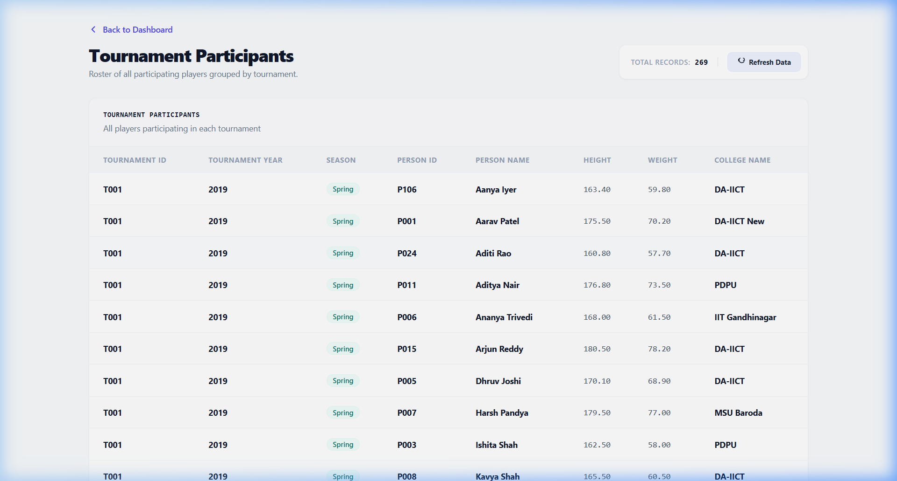

# Sport Sync: Tournament Database Manager

A premium, full-stack database application designed to administer, query, and analyze sports tournaments, teams, matches, and participant schedules. Built with a modern **SaaS Dashboard layout** utilizing **React**, **TypeScript**, **Tailwind CSS**, **Node.js/Express**, and **PostgreSQL**.

---

## 📸 Application Showcase

### 1. Main Dashboard Canvas
The landing screen groups features logically into operations, analytical reports, and stored functions. It features a real-time blinking PostgreSQL database health banner.


### 2. Multi-Step Form with Progress Stepper
The registration form utilizes a custom visual progress stepper. Choosing "Player" vs "Spectator" changes the layout conditionally to gather role-specific physical attributes or ticket pass tiers.


### 3. Borderless Report Tables & Status Badges
Complex analytical reports are displayed in a borderless tabular format with zebra striping. Data fields like seasons (`spring`/`fall`), outcome states, and ticket tiers are converted into dynamic colored pill badges.


---

## 🚀 Key Features

* **Sleek SaaS Dashboard**: Groups commands into *Management & Operations*, *Analytical Reports*, and *Database Function Queries*.
* **Relational Integrity Forms (CRUD)**:
  * **Register Person**: Conditional multi-step form to register generic persons as specialized athletes or ticketed spectators.
  * **Create Tournament**: Checks date overlapping boundaries and validates tournament years.
  * **Manage Player**: Custom interface to insert, update contact info/physical attributes, or delete players. Displays a side-by-side proposed modifications comparison table.
* **Complex SQL Analytics**:
  * **Tournament Participants**: Detailed view of registered players grouped by season schedule.
  * **Top Scoring Players**: Analytics querying the top 10 scoring athletes.
  * **Team Win Statistics**: Multi-table aggregate statistics showcasing Wins, Losses, and Draws.
  * **Multi-Department Organizers**: Intersects organizer rosters who worked across different departments.
  * **Fall Undefeated Teams**: Custom subqueries locating teams undefeated during Autumn tournaments.
* **PostgreSQL Function Integration**: Calls database-stored procedures like `get_player_current_team_info(player_id)` to query player affiliations.

---

## 🛠️ Architecture & Tech Stack

```
sportWeb/
├── backend/              # Node.js & Express.js REST API
│   ├── db/
│   │   └── db.js        # PostgreSQL pool connection
│   ├── routes/          # API Route handlers (Players, Tournaments, Reports)
│   └── server.js        # Express server setup
├── frontend/            # React & TypeScript Client SPA
│   ├── src/
│   │   ├── components/  # Reusable UI components (ReportTable)
│   │   ├── pages/       # Page views (Dashboard, Crud forms, reports)
│   │   └── App.tsx      # React router settings
│   └── tailwind.config.js
└── POSTGRES_DDL.sql     # Database DDL structure, constraints, and functions
```

### Technologies Used:
* **Frontend**: React (v18), TypeScript, Tailwind CSS, React Router (v6), Axios.
* **Backend**: Node.js, Express.js.
* **Database**: PostgreSQL (v12+), `pg` connection pool.

---

## ⚙️ Installation & Configuration

### Prerequisites
* **Node.js** (v16 or higher)
* **PostgreSQL** (v12 or higher)

### 1. Database Setup
1. Open your PostgreSQL console and create the database:
   ```sql
   CREATE DATABASE sporttournament;
   ```
2. Populate the tables and functions using the DDL script:
   ```bash
   psql -U postgres -d sporttournament -f POSTGRES_DDL.sql
   ```

### 2. Backend Setup
1. Navigate to the backend directory and install dependencies:
   ```bash
   cd backend
   npm install
   ```
2. Create a `.env` file in `backend/` and configure database connection parameters:
   ```env
   DB_HOST=localhost
   DB_PORT=5432
   DB_NAME=sporttournament
   DB_USER=postgres
   DB_PASSWORD=your_postgres_password
   PORT=5000
   NODE_ENV=development
   ```
3. Start the Express server:
   ```bash
   npm start
   ```

### 3. Frontend Setup
1. Navigate to the frontend directory and install dependencies:
   ```bash
   cd ../frontend
   npm install
   ```
2. Launch the Vite dev server:
   ```bash
   npm run dev
   ```
3. Open `http://localhost:3000` in your web browser.

---

## 📡 API Reference endpoints

### Operations & CRUD
* `POST /api/person/player` — Register a person and athlete profile.
* `POST /api/person/spectator` — Register a spectator with tournament tickets.
* `POST /api/tournament` — Add a new tournament schedule (Year limit: 2000-2035).
* `GET /api/player/:id` — Load single player profile.
* `PUT /api/player/:id` — Update contact data and measurements.
* `DELETE /api/player/:id` — Delete a player.

### Reporting & Views
* `GET /api/report/tournament-participants` — Roster of players grouped by tournament.
* `GET /api/report/top-scoring` — Top 10 high-scoring players list.
* `GET /api/report/team-stats` — General win/loss statistics.
* `GET /api/report/multidept-organizers` — Organizers working across multiple departments.
* `GET /api/report/fall-undefeated` — Unbeaten Autumn teams list.

### Database Functions
* `GET /api/function/player-team-college/:id` — Returns `get_player_current_team_info` results.
