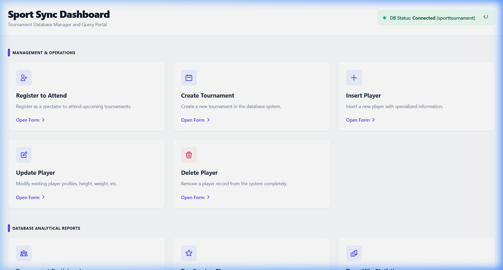
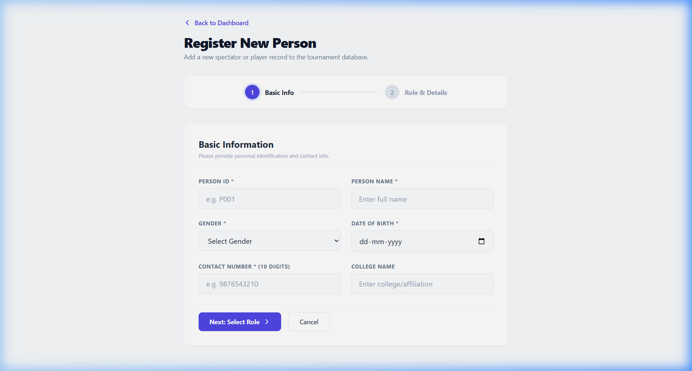
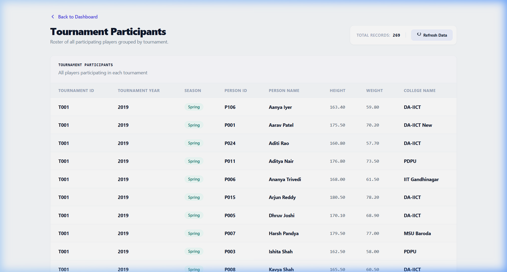

# SportSync: Sports Tournament Database Manager

A PostgreSQL database, designed to administer, query, and analyze sports tournaments, teams, matches, and participant schedules.

## Why SportSync?
Manual tournament management breaks down fast, with duplicate registrations, missed schedule updates, delayed results, and no historical record. SportSync replaces that with a single, centralized, normalized PostgreSQL database,  one source of truth for every player, team, match, result, venue, sponsor, and statistic, built through a full requirements-to-schema design process.

---

## ER Diagram


> Full requirement gathering, noun-verb analysis, and normalization rationale are in [`docs/`](docs/).

---


## Repository Structure

```
SportTournamentManagementSystem/
├── README.md
├── sportER.png                                   # Entity-relationship diagram
├── docs/
│   ├── SRS.pdf                                   # Requirements: interviews, questionnaire, fact-finding
│   ├── NounVerbAnalysis_RelationalSchema.pdf      # Noun-verb extraction, ER-to-relational mapping
│   └── Normalization_and_DDL_Design.pdf          # FDs, BCNF decomposition, design rationale
├── schema/
│   └── tables.sql                             # Full DDL 28 tables with constraints
├── data/
│   └── seed_data.sql                          # Seed dataset simulating a real multi-college tournament
├── queries/
│   └── queries.sql                            # Analytical queries and stored procedures
└── screenshots/                                   # Application UI screenshots
```

---

## Project Journey

This database was built through a complete DBMS design lifecycle, documented step-by-step in `docs/`:

1. **Requirements Gathering (SRS)**: background research on 5 real college fests, 3 stakeholder interviews (player, event coordinator, sports committee), a 28-response questionnaire, and direct observation, synthesized into functional/non-functional requirements and an access control matrix.
2. **Noun-Verb Analysis**: systematic extraction of candidate entities, attributes, and relationships from the problem description, with an explicit accepted/rejected list (e.g., rejecting "Blood Group" and "Score" as attributes rather than entities).
3. **ER Modeling**: a full ER diagram using specialization and aggregation to accurately capture relationship-dependent data.
4. **Relational Mapping & Normalization** : every table's functional dependencies documented, verified against 1NF/2NF/3NF, then decomposed to **BCNF** where violations existed.
5. **DDL Implementation**: The normalized design translated into PostgreSQL DDL with full constraint enforcement.

---

## Conceptual Model

### Specialization & Generalization
`Person` is the superclass, holding attributes shared by every human in the system: `person_id` (PK), `person_name`, `gender`, `dob`, `contact_no`, `college_name`, `roles`.

- **`Player` IS-A `Person`** — inherits the primary key (`player_id` references `Person(person_id)`) and adds `height`, `weight`, `bloodgroup`, `joining_year`.
- **`Spectator` IS-A `Person`** — inherits the primary key (`spectator_id` references `Person(person_id)`) and is specialized for ticket-pass holders.

Participation is **total** from Player/Spectator to Person (every player/spectator must be a person) and **partial** from Person (not every person is a player or spectator — some are organizers, coaches, etc.). This avoids redundancy, minimizes nulls, and models real-world participant roles cleanly.

### Aggregation for Relationship-Dependent Data
A player's performance in a specific match, or a team's outcome in a specific match, can't live in either parent entity alone:

- **`PlayerPlaysMatch` → `PlayerStatistics`** — captures `score` and `status_name` per player per match (PK: `player_id, match_id, status_name`).
- **`TeamPlaysMatch` → `TeamStatistics` / `Result`** — captures team-level outcomes (win/loss/draw) and stats per match.

This enables historical, match-level analytics at both the player and team level.

### Key Relationship Mappings

| Relationship | Cardinality | Participation |
|---|---|---|
| Person – Player / Spectator | 1:1 (specialization) | Total (Player/Spectator) · Partial (Person) |
| Player – Team | M:N (via `PlayerTeam`) | Tracks `joining_date`, `end_date` for transfers |
| Team – Sport | M:1 | Each team plays exactly one sport |
| Match – Venue / Referee | M:1 | Partial (venue/referee may be unassigned) |

---

## Data Model

**Core Entities**

| Entity | Purpose |
|---|---|
| `Person` | Base identity for every human in the system — superclass for Player/Spectator |
| `Player` | Subclass of Person — height, weight, blood group, joining year |
| `Team` | A college team registered under a specific sport |
| `Match` | A scheduled game — sport, tournament, venue, referee, date, time |
| `Result` | Outcome of a match — win/loss/draw per team |
| `Tournament` | One edition of a fest — year, season, start/end dates |
| `Sports` / `SportType` | Sport discipline and its classification (BCNF split) |
| `Venue` | Physical match location |
| `Referee` | Official assigned to conduct matches |
| `Coach` | Trainer assigned to a team |
| `Organizer` | Committee member running the tournament |
| `Sponsors` / `Company` | Funding organizations and their details (BCNF split) |
| `Equipments` | Sport-specific equipment inventory |

**Junction Tables** (relationships with their own attributes)

| Table | Relationship | Key Attributes |
|---|---|---|
| `PlayerTeam` | Player ↔ Team | `joining_date`, `end_date` (full roster history) |
| `TeamCoach` | Team ↔ Coach | `join_date`, `end_date` |
| `PlayerSport` | Player ↔ Sport | `level`, `experience_years` |
| `TeamPlaysMatch` | Team ↔ Match | — |
| `PlayerPlaysMatch` | Player ↔ Match | — |
| `SponsorsTournament` | Sponsor ↔ Tournament | `budget` |
| `SpectatorPass` | Person ↔ Tournament | `pass_type` (gold/silver/regular) |
| `SpectatorViewMatch` | Person ↔ Match | — |
| `OrganizeTournament` | Organizer ↔ Tournament | `role`, `department` |
| `SportEquipments` | Sport ↔ Equipment | `number` |

**Weak / Statistics Entities**

| Entity | Owner | Purpose |
|---|---|---|
| `SportRules` | Sports | Rules text per sport |
| `PlayerStatistics` | Player + Match | Sport-agnostic stat rows (`status_name`, `score`) |
| `TeamStatistics` | Team + Match | Sport-agnostic team stat rows |

---

## Database Building, Constraints & BCNF Normalization

### BCNF Decomposition

Two relations violated BCNF during dependency analysis:

**`Sponsors(sponsor_id, name, contact_no, address, company)`**
`company → address` existed, and `company` wasn't a superkey — a BCNF violation causing update/deletion anomalies. Decomposed into:
- `Company(company` [PK]`, address` [NOT NULL]`)`
- `Sponsors(sponsor_id` [PK]`, name, contact_no, company` [FK → `Company`]`)`

**`Sports(sport_id, sport_name, type)`**
`sport_name → type` existed, and `sport_name` wasn't a superkey (`sport_id` is the PK). Decomposed into:
- `Sports(sport_id` [PK]`, sport_name` [UNIQUE, NOT NULL]`)`
- `SportType(sport_name` [PK, FK → `Sports`]`, type` [NOT NULL]`)`

### Referential Integrity & Cascading Actions

Every FK's `ON DELETE` behavior was chosen by asking: *does the child row have meaning without the parent?*

- **`CASCADE`** — applied to dependent tables (`Player`, `SpectatorPass`, `PlayerPlaysMatch`, `PlayerTeam`, `Result`, etc.) so linked records clean up when a parent `Person`, `Match`, or `Team` is deleted.
- **`SET NULL`** — used for `Team.captain_id`, `Match.referee_id`, `Match.venue_id` — the team survives without a captain, the match still happened without a recorded referee/venue.
- **`RESTRICT`** — applied to `Company` in `Sponsors`, preventing deletion of a company while active sponsor profiles reference it.

### Semantic CHECK Constraints

- **Regex phone validation:** `contact_no ~ '^[0-9]{10}$'` on `Sponsors`, `Coach`, `Referee`, `Organizer`.
- **Temporal checks:** `end_date >= start_date` (Tournament), `check_out_date >= check_in_date` (Accommodation), match dates bounded between year 2000 and one year in the future.
- **Domain constraints:** `gender` ∈ {male, female, other}; `pass_type` ∈ {gold, silver, regular}; `outcome` ∈ {win, loss, draw}; `level` ∈ {beginner, intermediate, advanced, professional}; `department` ∈ {Logistics, Operations, Marketing, Finance, Refereeing, Medical, Hospitality, Technical, Volunteers} — all case-insensitive.

---

## Stored Procedures & Advanced Database Logic

### `get_player_current_team_info` — Active Team Lookup
Retrieves a player's current active team and college affiliation:

```sql
CREATE OR REPLACE FUNCTION get_player_current_team_info(p_player_id VARCHAR)
RETURNS TABLE (
    team_name VARCHAR,
    college_name VARCHAR
) AS $$
BEGIN
    RETURN QUERY
    SELECT
        T.team_name,
        T.college_id AS college_name
    FROM
        PlayerTeam PT
    INNER JOIN
        Team T ON PT.team_id = T.team_id
    WHERE
        PT.player_id = p_player_id
        AND (PT.end_date IS NULL OR PT.end_date > CURRENT_DATE)
        AND PT.joining_date <= CURRENT_DATE
    ORDER BY PT.joining_date DESC
    LIMIT 1;
END;
$$ LANGUAGE plpgsql;
```

### `get_organizers_by_department` — Department Roster
Aggregates organizers who worked in a specific department and consolidates their roles:

```sql
CREATE OR REPLACE FUNCTION get_organizers_by_department(dept_name VARCHAR)
RETURNS TABLE (
    member_id VARCHAR(10),
    member_name VARCHAR(100),
    contact_no VARCHAR(10),
    role TEXT
) AS $$
BEGIN
    RETURN QUERY
    SELECT o.member_id, org.member_name, org.contact_no, STRING_AGG(DISTINCT o.role, ', ')
    FROM OrganizeTournament o
    JOIN Organizer org ON o.member_id = org.member_id
    WHERE LOWER(o.department) = LOWER(dept_name)
    GROUP BY o.member_id, org.member_name, org.contact_no;
END;
$$ LANGUAGE plpgsql;
```

### Complex Analytical Queries
- **Fall, Undefeated Teams** — teams with no losses or draws in Autumn tournaments, using `EXISTS`/`NOT EXISTS` subqueries.
- **Top Scoring Players** — top 10 highest scorers across all matches, aggregated from `PlayerStatistics`.

---

## API Reference

### Operations & CRUD
| Endpoint | Description |
|---|---|
| `POST /api/person/player` | Register a person and athlete profile |
| `POST /api/person/spectator` | Register a spectator with tournament tickets |
| `POST /api/tournament` | Add a new tournament schedule |
| `GET /api/player/:id` | Load single player profile |
| `PUT /api/player/:id` | Update contact data and measurements |
| `DELETE /api/player/:id` | Delete a player |

### Reporting & Views
| Endpoint | Description |
|---|---|
| `GET /api/report/tournament-participants` | Roster of players grouped by tournament |
| `GET /api/report/top-scoring` | Top 10 high-scoring players list |
| `GET /api/report/team-stats` | General win/loss statistics |
| `GET /api/report/multidept-organizers` | Organizers working across multiple departments |
| `GET /api/report/fall-undefeated` | Unbeaten Autumn teams list |

### Database Functions
| Endpoint | Description |
|---|---|
| `GET /api/function/player-team-college/:id` | Returns `get_player_current_team_info` results |

---

## Sample Dataset

The seed data simulates a real multi-college tournament across 6 colleges (DA-IICT, Nirma University, PDPU, LDCE, MSU Baroda, IIT Gandhinagar) and 10 sports (Football, Cricket, Basketball, Badminton, Tennis, Volleyball, Table Tennis, Chess, Powerlifting, Carrom):

| Table | Rows | Table | Rows |
|---|---|---|---|
| Person | 300 | PlayerTeam | 230 |
| Player | 200 | TeamPlaysMatch | 60 |
| Team | 60 | TeamCoach | 61 |
| Match | 60 | PlayerStatistics | 55 |
| Result | 120 | TeamStatistics | 60 |
| Tournament | 14 | Accommodation | 112 |
| SpectatorPass | 150 | OrganizeTournament | 98 |
| Sponsors | 30 | SpectatorViewMatch | 64 |
| Company | 20 | PlayerPlaysMatch | 90 |

---

## Setting Up

```bash
# 1. Clone the repository
git clone https://github.com/SaloniVaghela-05/SportTournamentManagementSystem.git
cd SportTournamentManagementSystem

# 2. Create the database
psql -U postgres -c "CREATE DATABASE SportTournamentDB;"

# 3. Load the schema
psql -U postgres -d SportTournamentDB -f schema/01_tables.sql

# 4. Load the seed data
psql -U postgres -d SportTournamentDB -f data/02_seed_data.sql

# 5. Run sample queries and stored procedures
psql -U postgres -d SportTournamentDB -f queries/03_queries.sql
```

---

## Built With

| Tool | Purpose |
|---|---|
| PostgreSQL | Primary database engine — schema, constraints, PL/pgSQL functions |
| pgAdmin / psql | Schema design and query execution |
| draw.io / Lucidchart | ER diagram design |

---

## Application Showcase

### 1. Main Dashboard
The landing screen groups features logically into operations, analytical reports, and stored functions, with a real-time blinking PostgreSQL database health banner.



### 2. Multi-Step Registration Form
A custom visual progress stepper. Choosing "Player" vs "Spectator" changes the layout conditionally to gather role-specific physical attributes or ticket pass tiers.



### 3. Analytical Report Tables
Complex analytical reports are displayed in a borderless tabular format with zebra striping. Fields like season (`spring`/`fall`), outcome, and ticket tier render as dynamic colored status badges.



---
## Team

- Saloni Vaghela (202403048)
- Yashvi Patel (202403035)

Built as part of the DBMS (MC212) coursework at DA-IICT.
